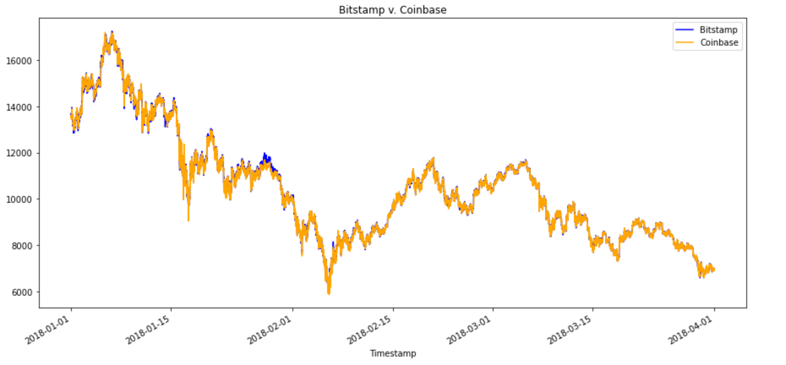
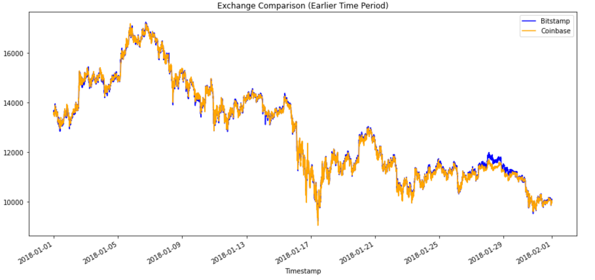
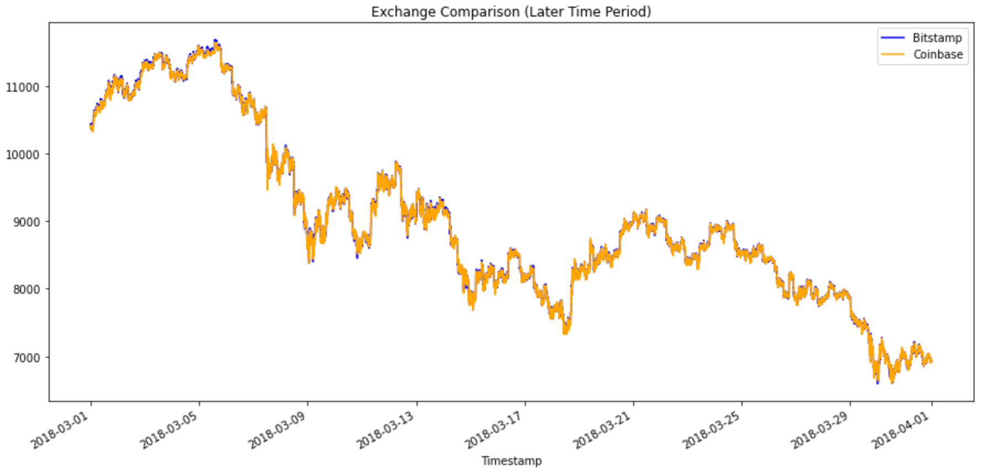
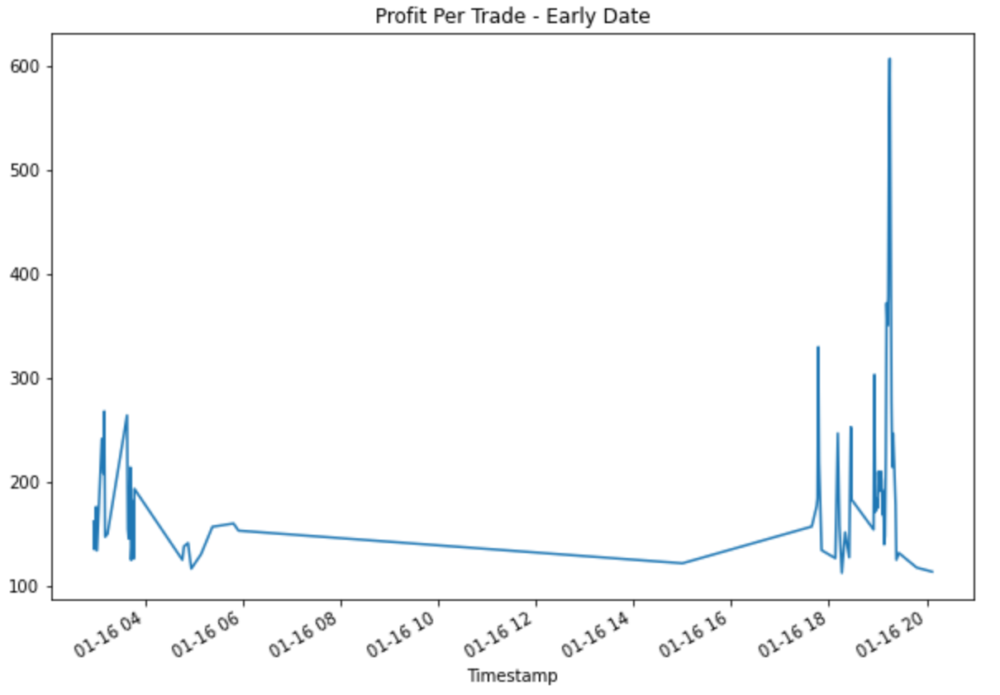
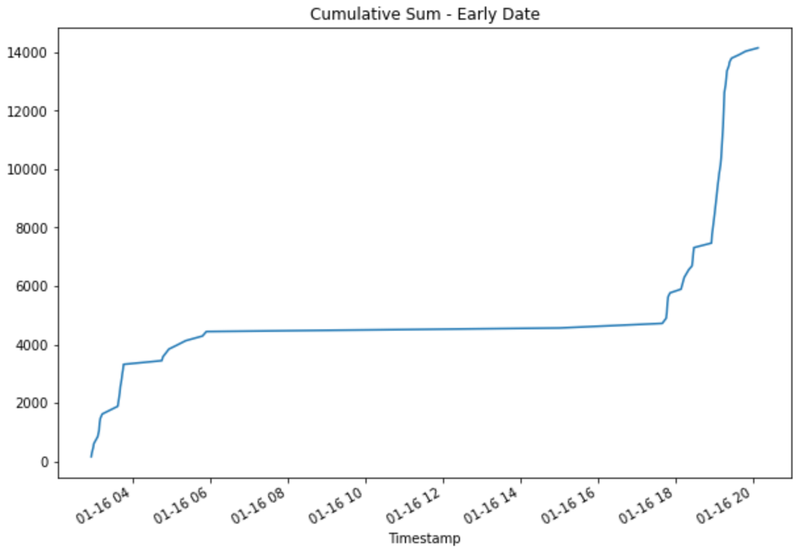
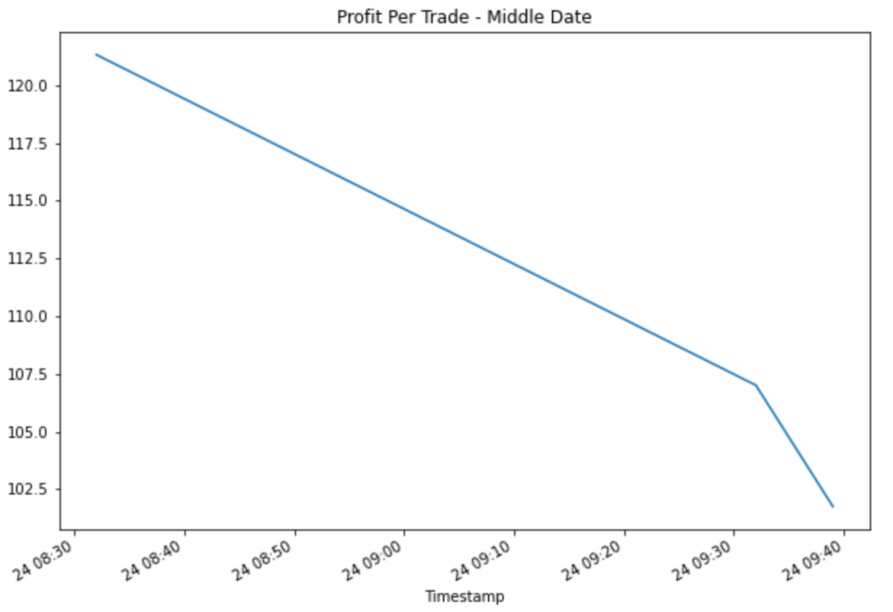
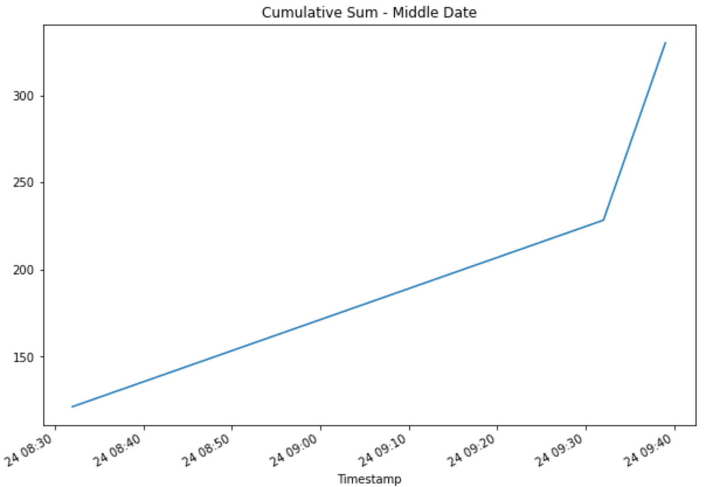
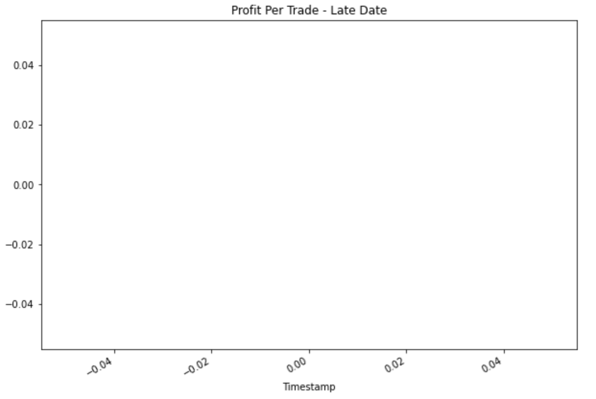
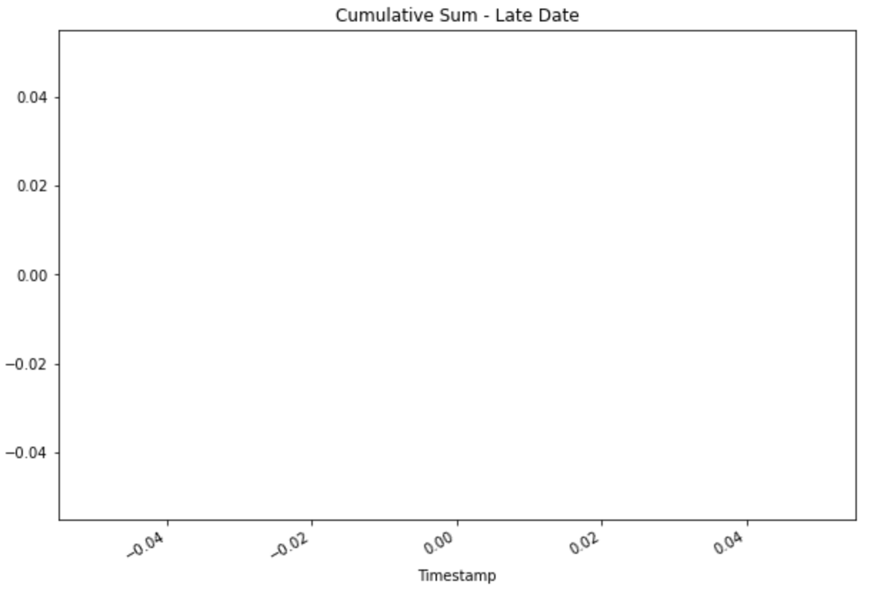

# Bitcoin Arbitrage

This notebook attempts to look at the possible arbitrage opportunities that were available during the first three months of 2018 by selecting and analysing 3 specific dates during that time period for any profitable arbitrage trades.
---

## Technologies

This project leverages python 3.7.9 with the following packages:

* [pandas](https://pandas.pydata.org/docs/) - For the analysis of bitcoin across exchanges.

* [matplotlib](https://matplotlib.org/) - For the visualization of bitcoin across exchanges.   

On the terminal, under the conda dev environment, install the following:

---

## Installation Guide

Before running the application first install the following dependencies.

```
  pip install pandas
```

---

## Analysis
For this analysis we compared the price of Bitcoin on Bitstamp vs. Coinbase for the first three months of 2018.

After collecting and preparing the data, by removing NAs, we obtain the following chart comparing the price of Bitcoin on Bitstamp vs. Coinbase.



Wherever we are able to see the blue line in the chart shows there might be possible arbitrage opportunities.

Digging deeper we can see that during a one month time period earlier in the dataset we are able to see the blue line more frequently than during a one month time period later in the dataset.





Finally, we focus our analysis on three specific dates, one early, one middle, and one late date in the dataset. We analyze the potential arbitrage profits, after accounting for trading costs, for each one of the three dates in the dataset.










Looking at a three month time period during Jan-March 2018 it can be seen that the during three different periods arbitrage opportunities steadily decrease. For our beginning date we can see we would have made a cummulative profit of around $14,000. Then, for our middle date our cumulative profit dramatically decreases to around $300. Finally, for our ending date there are zero profitable arbitrage opportunities.

Overall this analysis shows that arbitrage situations rarely occur, and when they do, they don’t last long.

---

## Contributors

Nathan Patterson

---

## License

MIT
